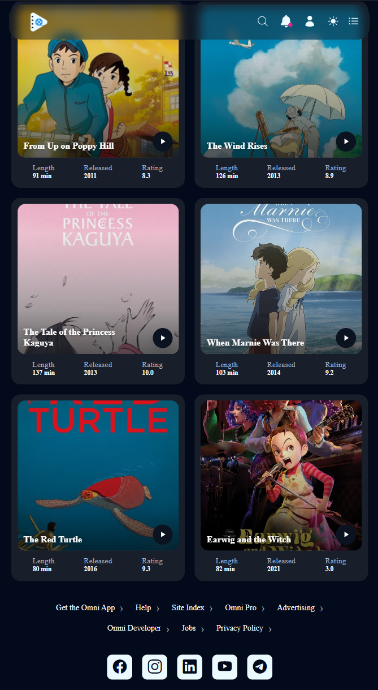

# TrackTV App

This project is a responsive web application that showcases movie cards with modern UI. It is built using HTML, CSS, JavaScript, and SASS for advanced styling and maintainability.

## Features

- **SASS Styling**: The project uses SASS for modular and maintainable stylesheets. All SASS files are located in the `style/` directory.
- **Dark/Light Mode**: Users can toggle between dark and light themes for a personalized viewing experience.

**Light mode:**

<div align="center">
  
</div>

**Dark mode:**

<div align="center">
  
</div>

- **Responsive Design**: The layout adapts seamlessly to different screen sizes, providing an optimal experience on both desktop and mobile devices.
- **Mobile Hamburger Menu**: For lower resolutions, a mobile-friendly hamburger menu is implemented to enhance navigation.

<div align="center">
  
</div>

## Project Structure

- `index.html` - Main HTML file
- `main.css` - Compiled CSS files
- `script.js` - JavaScript code for interactivity
- `assets/` - Contains images and theme assets
- `style/` - SASS source files
  
## Getting Started

1. Clone the repository:
```bash
git clone https://github.com/catalina-constantin/Track-TV.git
```
2. Open `index.html` in your browser to view the app.
3. To modify styles, edit the SASS files in the `styles/` directory and compile them to CSS using:
```bash
sass --watch style/styles.scss:main.css
```

## Technologies Used

- **HTML5**: Markup structure for the web app
- **CSS3**: Styling and layout
- **SASS (SCSS)**: Modular and maintainable stylesheets
- **JavaScript (ES6+)**: Interactivity and dynamic features

## License
This project is for educational purposes.
